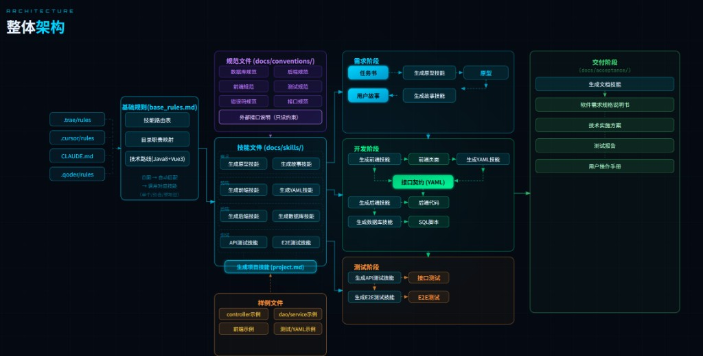
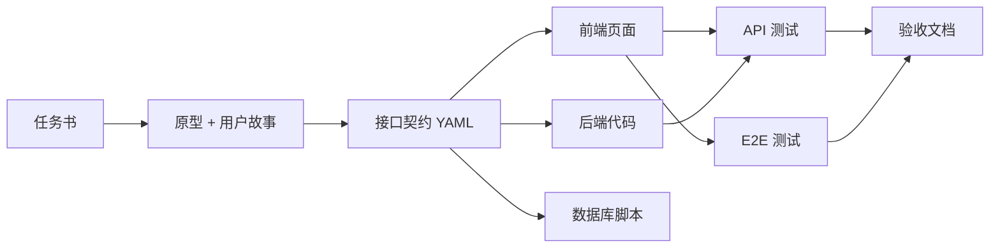

# demo-ai

> **AI 驱动的全栈开发管理模板** — 以技能（Skill）编排需求、开发、测试与交付的完整软件生命周期。

[](LICENSE)
[](https://www.oracle.com/java/)
[](https://spring.io/projects/spring-boot)
[](https://vuejs.org/)

---

## 简介

`demo-ai` 是一套面向 **Java 8 + Spring Boot + Vue 3** 技术栈的 AI 协作开发模板。它将规范文档、技能脚本与目录约定整合为统一工作流，让 Cursor、Claude、Trae、Qoder 等 AI 助手按相同规则生成可交付的全栈代码。

核心设计原则：

- **契约驱动开发** — 前端先输出 OpenAPI YAML，后端严格依据契约实现，禁止单方面修改已冻结的接口定义
- **技能路由** — 根据用户意图自动匹配对应 Skill，支持单技能、组合技能与递归调用
- **规范约束** — 数据库、后端、前端、测试、错误码等约定统一维护，AI 生成代码前必须读取
- **阶段化交付** — 需求 → 开发 → 测试 → 验收，各阶段产物路径固定、可追溯

---

## 整体架构



```
用户意图 → 基础规则路由 → 匹配 Skill → 读取规范 → 生成产物
                ↓
    需求阶段 → 开发阶段 → 测试阶段 → 交付阶段
```

| 阶段 | 输入 | 技能 | 产出 |
|------|------|------|------|
| **需求** | 任务书 | `req_prototype` · `req_story` | HTML 原型 · 用户故事 |
| **开发** | 用户故事 | `web` · `srv` · `db_design` | 前端页面 · 后端代码 · SQL · **接口契约 YAML** |
| **测试** | 接口契约 | `test_api` · `test_e2e` | API 测试 · E2E 测试 |
| **交付** | 全量产物 | 验收文档模板 | SRS · 技术方案 · 测试报告 · 用户手册 |

> **接口契约 YAML**（`docs/api/<模块>.yaml`）是前后端协作的唯一真相来源。

---

## 技术栈

| 层级 | 技术 |
|------|------|
| 后端 | Java 8 · Spring Boot 2.7.18 |
| 前端 | Vue 3 · TypeScript |
| 接口 | OpenAPI 3.x（YAML 契约） |
| 测试 | Playwright（E2E）· API 自动化测试 |
| AI 集成 | Cursor · Claude · Trae · Qoder |

---

## 目录结构

```
demo-ai/
├── .cursor/rules/          # Cursor AI 规则入口
├── .trae/rules/            # Trae AI 规则入口
├── .qoder/rules/           # Qoder AI 规则入口
├── CLAUDE.md               # Claude 规则入口
│
├── docs/
│   ├── rules/
│   │   └── base_rules.md   # ★ 全局基础规则（技能路由表 + 目录映射）
│   ├── skills/             # ★ 技能库（AI 执行脚本）
│   ├── conventions/        # 规范约束（后端 / 前端 / DB / 测试 / 错误码）
│   ├── requirements/       # 需求产物（任务书 / 原型 / 用户故事）
│   ├── api/                # 接口契约 YAML
│   ├── db/                 # 数据库 DDL 脚本
│   ├── acceptance/         # 验收文档模板
│   └── assets/             # 文档资源
│
├── frontend-client/web/    # Vue 3 前端项目
├── backend-server/         # Spring Boot 后端服务
└── tests/                  # API & E2E 测试
```

---

## 技能路由

AI 助手在执行任务前读取 [`docs/rules/base_rules.md`](docs/rules/base_rules.md)，根据用户意图自动匹配技能：

| 用户意图 | 技能文件 |
|----------|----------|
| 生成原型 / 页面设计 | [`docs/skills/req_prototype.md`](docs/skills/req_prototype.md) |
| 生成用户故事 | [`docs/skills/req_story.md`](docs/skills/req_story.md) |
| 生成需求（原型 + 故事） | [`docs/skills/req.md`](docs/skills/req.md) |
| 生成数据库设计 | [`docs/skills/db_design.md`](docs/skills/db_design.md) |
| 生成后端代码 | [`docs/skills/srv.md`](docs/skills/srv.md) |
| 生成前端页面 | [`docs/skills/web_page.md`](docs/skills/web_page.md) |
| 生成接口契约 YAML | [`docs/skills/web_yaml.md`](docs/skills/web_yaml.md) |
| 生成前端（页面 + 接口） | [`docs/skills/web.md`](docs/skills/web.md) |
| 生成 API 测试 | [`docs/skills/test_api.md`](docs/skills/test_api.md) |
| 生成 E2E 测试 | [`docs/skills/test_e2e.md`](docs/skills/test_e2e.md) |
| 生成完整测试 | [`docs/skills/test.md`](docs/skills/test.md) |
| **生成完整项目** | [`docs/skills/project.md`](docs/skills/project.md) |

组合技能 `project.md` 按顺序执行：**需求 → 前端 → 后端 → 测试**，每阶段完成后才进入下一阶段。

---

## 快速开始

### 1. 克隆仓库

```bash
git clone https://github.com/Fjie17/demo-ai.git
cd demo-ai
```

### 2. 在 AI 编辑器中打开

推荐使用 [Cursor](https://cursor.com/) 打开项目。规则已配置在 `.cursor/rules/`，AI 会自动读取 `base_rules.md`。

### 3. 用自然语言驱动开发

在 AI 对话中直接描述需求，例如：

```
为 rank 模块生成完整功能（需求 + 前端 + 后端 + 测试）
```

AI 将按技能路由表依次读取规范与技能文件，在约定目录下生成产物。

### 4. 模块标识

所有模块标识以 [`docs/requirements/modules.md`](docs/requirements/modules.md) 为唯一来源，禁止自行创造。当前示例模块包括 `rank`（段位维护）、`exam`（考试）、`leaderboard`（排行榜）等。

---

## 开发工作流



**路径约定示例**（以 `rank` 模块为例）：

| 类型 | 路径 |
|------|------|
| 任务书 | `docs/requirements/taskbrief/rank.md` |
| 原型 | `docs/requirements/prototype/rank.html` |
| 用户故事 | `docs/requirements/story/user-story-rank.md` |
| 接口契约 | `docs/api/rank.yaml` |
| 数据库脚本 | `docs/db/zhhg_exam_rank_*.sql` |
| 前端页面 | `src/views/rank/` |
| API 测试 | `tests/api/rank.api.spec.ts` |
| E2E 测试 | `tests/e2e/rank.e2e.spec.ts` |

完整映射见 [`docs/rules/base_rules.md`](docs/rules/base_rules.md)。

---

## 规范文档

| 领域 | 路径 |
|------|------|
| 后端规范 | [`docs/conventions/backend/`](docs/conventions/backend/) |
| 前端规范 | [`docs/conventions/frontend/`](docs/conventions/frontend/) |
| 数据库规范 | [`docs/conventions/db/`](docs/conventions/db/) |
| 测试规范 | [`docs/conventions/testing/`](docs/conventions/testing/) |
| 错误码规范 | [`docs/conventions/error-codes.md`](docs/conventions/error-codes.md) |

---

## 贡献

欢迎提交 Issue 与 Pull Request。贡献前请先阅读 [`docs/rules/base_rules.md`](docs/rules/base_rules.md) 了解项目约定。

---

## 许可证

本项目采用 [Apache License 2.0](LICENSE) 开源。

```
Copyright 2026 Fjie17

Licensed under the Apache License, Version 2.0
```
